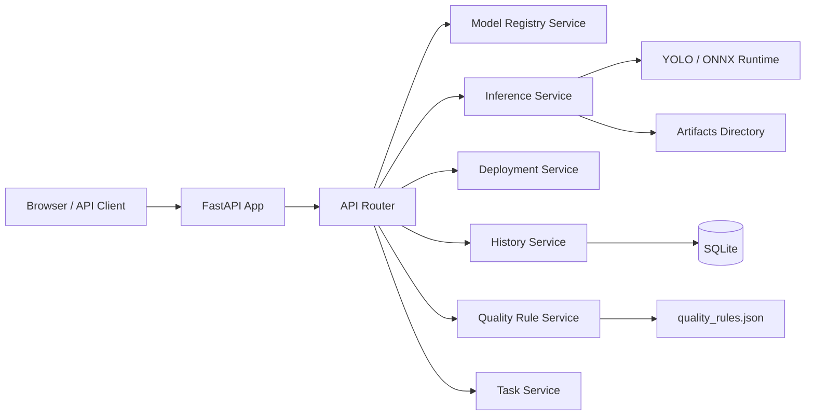

# 面向生鲜分拣场景的多模型视觉质检与自动化回流平台

这是一个面向 AI 应用开发岗位整理的工程化视觉项目。项目以生鲜分拣质检为业务场景。刚开始这原本只是YOLO模型训练平台，于是我突发奇想，我把原本偏脚本化的 YOLO 检测流程，重构成了一个具备多模型管理、质检推理、人工复核、bad case 回流和复训样本整理能力的平台。

另外我保留了部分之前的模型训练平台的文件。

支持的核心能力：

- 多模型管理：上传、启用、删除 `.pt` / `.onnx` 模型，并通过 `.yaml` 同步类别映射
- 多种推理入口：单图检测、批量异步检测、浏览器摄像头实时检测
- 业务规则引擎：把检测结果映射为 `pass / warning / critical`
- 回流闭环：人工复核、bad case 回流、复训目录、训练批次、标准样本包导出
- 部署与评测：ONNX 导出、TensorRT 导出链路、Benchmark、Docker / Docker Compose
- 工程交付：OpenAPI 文档、API smoke tests、GitHub Actions CI

## 快速启动

### 方式一：一键启动

适合首次体验。脚本会执行 Docker Compose 构建与后台启动。

```powershell
python start.py
```

访问地址：

- Web 页面：`http://127.0.0.1:8001/`
- Swagger：`http://127.0.0.1:8001/docs`

### 方式二：标准 Docker Compose

```powershell
docker compose up --build -d
```

停止服务：

```powershell
docker compose down
```

查看日志：

```powershell
docker compose logs -f
```

## 项目的功能

- 把多模型推理能力服务化，封装为标准 REST API 和 WebSocket 接口
- 把原始检测结果转成业务可读的生鲜质检结论
- 把复核、回流、复训样本整理组织成可演示的数据闭环
- 具备模型管理、部署评测、样本导出和容器化交付能力
- 完成前后端联调，不停留在命令行脚本阶段

## 模型权重说明

模型权重未随仓库提交。运行前请将训练好的模型放到：

`runs/train/fruit_quality_check/weights/best.pt`

或通过环境变量指定：

`FRUIT_MODEL_PATH=你的模型路径`

## 推荐路径

1. 首页概览
  先展示当前启用模型、最近 Benchmark 摘要和闭环进度，让别人快速理解这不是单纯的 YOLO demo。
2. 模型中心
  展示 `.pt / .onnx / .yaml` 上传、模型切换、模型对比看板和部署评测摘要。
3. 单图或批量质检
  演示输入图片后得到标注图、质检结论和业务规则映射结果。
4. 复核与 bad case 回流
  展示误检 / 漏检样本如何进入回流队列，再进入复训目录。
5. 训练批次与样本包导出
  展示如何把回流样本沉淀为可复训样本池，并导出标准样本包。

## 功能概览

### 1. 模型中心

- 上传 `.pt` / `.onnx` 模型
- 上传 `.yaml` 更新类别映射
- 启用模型、删除模型、回退默认模型

### 2. 检测工作台

- 单图检测
- 批量检测
- 浏览器摄像头实时检测

### 3. 异步任务与结果管理

- 批量检测异步执行
- 前端轮询任务进度
- 导出 CSV / Excel 报表
- 历史记录回看与按条件清理

### 4. 业务规则引擎

- 配置 `pass / warning / critical` 阈值
- 配置 fresh / rotten 关键词
- 配置业务提示文案

### 5. 复核、回流与复训闭环

- 复核中心
- bad case 回流队列
- 复训目录与样本状态流转
- 训练批次与标准样本包导出
- 标签草稿编辑、预览与补框

### 6. 部署与性能

- ONNX 导出
- TensorRT 导出链路
- Benchmark 任务
- Docker / Docker Compose 容器化运行

## 系统架构




## 生鲜质检规则是怎么落地的

模型本身只会输出目标类别、置信度和框坐标，但业务场景更关心“这一批水果能不能通过质检”。  
所以平台在检测结果之上增加了一层规则引擎：

- `pass`：腐烂比例小于等于 `pass_max_rotten_rate`
- `warning`：腐烂比例大于 `pass_max_rotten_rate` 且小于等于 `warning_max_rotten_rate`
- `critical`：腐烂比例大于 `warning_max_rotten_rate`
- `detected`：当前模型仅输出检测结果，不参与鲜腐质检判断
- `no_detection`：没有检测到目标

这些规则不会写死在代码里，而是持久化在 `backend/runtime/quality_rules.json`，并且可以通过 Web 页面或 API 动态修改。

## 目录结构

```text
fruits/
├─ backend/
│  ├─ app/
│  │  ├─ api/
│  │  ├─ core/
│  │  └─ schemas/
│  ├─ artifacts/
│  ├─ models/
│  ├─ runtime/
│  ├─ services/
│  ├─ config.py
│  ├─ main.py
│  └─ schemas.py
├─ docs/
│  └─ RESUME_ENTRY.md
├─ frontend/
│  ├─ app.js
│  ├─ index.html
│  └─ styles.css
├─ tests/
│  └─ test_api_smoke.py
├─ .env.example
├─ .github/
│  └─ workflows/
│     └─ ci.yml
├─ cli.py
├─ Dockerfile
├─ docker-compose.yml
└─ requirements.txt
```

## 源码本地启动

### 1. 环境要求

- Python 3.12
- Node.js 20 以上
- Windows / Linux / macOS

### 2. 安装依赖

```bash
pip install -r requirements.txt
```

### 3. 启动服务

```bash
python cli.py serve --host 0.0.0.0 --port 8001
```

启动后访问：

- Web 页面：`http://127.0.0.1:8001/`
- Swagger：`http://127.0.0.1:8001/docs`
- OpenAPI：`http://127.0.0.1:8001/openapi.json`
- API Index：`http://127.0.0.1:8001/api/v1`

## 如何在自己的电脑上运行

### 方式 1：直接运行源码

```bash
git clone <your-repo-url>
cd fruits
pip install -r requirements.txt
python cli.py serve --host 0.0.0.0 --port 8001
```

如果只是在本机打开：

- `http://127.0.0.1:8001/`

如果你要让局域网内其他电脑访问：

1. 服务监听 `0.0.0.0`
2. 查询你电脑的局域网 IP
3. 放行防火墙 `8001` 端口

例如你的 IP 是 `192.168.1.23`，别人访问：

- `http://192.168.1.23:8001/`
- `http://192.168.1.23:8001/docs`

## 环境变量配置

项目支持通过环境变量覆盖默认路径和参数，示例见：[.env.example](.env.example)


| 变量名                             | 说明                        | 默认值                                                  |
| ------------------------------- | ------------------------- | ---------------------------------------------------- |
| `FRUIT_MODEL_PATH`              | 默认 PyTorch 模型路径           | `./runs/train/fruit_quality_check/weights/best.pt`   |
| `FRUIT_ONNX_MODEL_PATH`         | 默认 ONNX 模型路径              | `./runs/train/fruit_quality_check/weights/best.onnx` |
| `FRUIT_DATA_CONFIG_PATH`        | 数据集配置文件路径                 | `./data.yaml`                                        |
| `FRUIT_RESULTS_CSV_PATH`        | 训练结果 CSV 路径               | `./runs/train/fruit_quality_check/results.csv`       |
| `FRUIT_ARTIFACTS_DIR`           | 生成的标注图 / CSV / Excel 输出目录 | `./backend/artifacts`                                |
| `FRUIT_MODEL_STORE_DIR`         | 上传模型存储目录                  | `./backend/models`                                   |
| `FRUIT_HISTORY_DB_PATH`         | 历史记录数据库路径                 | `./backend/artifacts/history.db`                     |
| `FRUIT_QUALITY_RULES_PATH`      | 规则配置文件路径                  | `./backend/runtime/quality_rules.json`               |
| `FRUIT_DEFAULT_IMGSZ`           | 默认推理尺寸                    | `416`                                                |
| `FRUIT_DEFAULT_CONF`            | 默认置信度阈值                   | `0.25`                                               |
| `FRUIT_BACKGROUND_TASK_WORKERS` | 后台任务线程数                   | `2`                                                  |


## API 示例

### 单图检测

```bash
curl -X POST "http://127.0.0.1:8001/api/v1/inference/image" \
  -F "file=@./demo.jpg" \
  -F "imgsz=416" \
  -F "conf=0.25" \
  -F "save_artifact=true" \
  -F "record_history=true"
```

### 批量异步检测

```bash
curl -X POST "http://127.0.0.1:8001/api/v1/tasks/batch-inference" \
  -F "files=@./a.jpg" \
  -F "files=@./b.jpg" \
  -F "imgsz=416" \
  -F "conf=0.25" \
  -F "save_artifact=true" \
  -F "export_csv=true" \
  -F "export_excel=true"
```

提交后轮询任务：

```bash
curl "http://127.0.0.1:8001/api/v1/tasks/{task_id}"
```

### 获取质检规则

```bash
curl "http://127.0.0.1:8001/api/v1/settings/quality-rules"
```

### 更新质检规则

```bash
curl -X PUT "http://127.0.0.1:8001/api/v1/settings/quality-rules" \
  -H "Content-Type: application/json" \
  -d '{
    "enabled": true,
    "fresh_keywords": ["fresh", "新鲜", "好果"],
    "rotten_keywords": ["rotten", "腐烂", "坏果"],
    "pass_max_rotten_rate": 0.10,
    "warning_max_rotten_rate": 0.40,
    "messages": {
      "no_detection": "未检测到目标，请检查图片内容。",
      "detected_only": "当前模型仅展示检测结果，不输出质检等级。",
      "pass_message": "腐烂比例很低，可通过质检。",
      "warning_message": "检测到少量异常，建议复核。",
      "critical_message": "腐烂比例较高，建议剔除。"
    }
  }'
```

更多接口可直接查看 Swagger：

- `GET /docs`

## 标准 API 一览

### 系统

- `GET /api/v1`
- `GET /api/v1/system/health`
- `GET /api/v1/system/metadata`

### 模型

- `GET /api/v1/models`
- `POST /api/v1/models`
- `POST /api/v1/models/{model_id}/activate`
- `DELETE /api/v1/models/{model_id}`

### 推理

- `POST /api/v1/inference/image`

### 异步任务

- `GET /api/v1/tasks`
- `GET /api/v1/tasks/{task_id}`
- `POST /api/v1/tasks/batch-inference`
- `POST /api/v1/tasks/benchmark`

### 摄像头

- `WS /ws/webcam`

### 规则设置

- `GET /api/v1/settings/quality-rules`
- `PUT /api/v1/settings/quality-rules`

### 部署与性能

- `GET /api/v1/deployment/status`
- `POST /api/v1/deployment/onnx/export`

### 历史与清理

- `GET /api/v1/history/runs`
- `GET /api/v1/history/runs/{run_id}`
- `POST /api/v1/history/cleanup`
- `GET /api/v1/maintenance/storage`
- `POST /api/v1/maintenance/cleanup`

## 测试与 CI

本项目已经补充了最小可运行的 API smoke tests，覆盖：

- 首页可访问
- OpenAPI 可访问
- 健康检查
- 模型列表
- 规则配置
- 历史记录
- 存储信息
- 任务列表
- 摄像头 WebSocket ready 消息

本地运行：

```bash
python -m unittest discover -s tests -p "test_*.py" -v
node --check frontend/app.js
```

CI 配置见：[.github/workflows/ci.yml](.github/workflows/ci.yml)

## Docker 部署

### Docker Compose

```bash
docker compose up --build -d
```

后台运行：

```bash
docker compose up -d --build
```

停止：

```bash
docker compose down
```

查看日志：

```bash
docker compose logs -f
```

默认访问：

- `http://127.0.0.1:8001/`

### Docker build + run

```bash
docker build -t fruit-inspection .
docker run --rm -p 8001:8000 \
  -v ./backend/artifacts:/app/backend/artifacts \
  -v ./backend/models:/app/backend/models \
  -v ./backend/runtime:/app/backend/runtime \
  fruit-inspection
```

### 当前容器化方案做了什么

- 镜像内集成后端服务、前端静态页面和默认模型路径配置
- 将 `backend/artifacts`、`backend/models`、`backend/runtime` 挂载为持久化目录
- 内置健康检查，探测 `/api/v1/system/health`

这意味着：

- 标注图、CSV、Excel 不会因为容器重建而丢失
- 上传模型和当前激活状态可以保留
- 质检规则的修改可以保留

### Docker 实机验收

按专项清单完成一轮容器验收：

- 启动容器并检查状态
- 验证首页、Swagger、健康检查
- 验证模型中心
- 验证单图 / 批量 / 摄像头质检链路
- 验证复核回流与复训目录
- 验证训练批次导出与样本包结构
- 验证模型中心、部署评测与样本导出主链路

专项清单见：[docs/DOCKER_ACCEPTANCE.md](docs/DOCKER_ACCEPTANCE.md)

当前代码层面已完成：

- `docker-compose.yml` YAML 语法校验
- `Dockerfile` 关键项静态检查
- 提供 `start.py` 封装 Docker Compose 启动流程

### TensorRT 说明

当前项目已经接入 TensorRT 导出与 Benchmark 能力位，前端和后端链路都已打通。  
实际执行 TensorRT 导出和 TensorRT Benchmark 仍然依赖：

- NVIDIA GPU
- CUDA 环境
- TensorRT Python 依赖

如果当前环境没有安装 TensorRT，平台会在部署与评测页中明确提示依赖未就绪。

当前开发机已完成一次 TensorRT 真机验收：

- GPU：`NVIDIA GeForce RTX 3060 Laptop GPU`
- CUDA：`13.1`
- TensorRT：`10.16.1.11`
- 模型：`YOLO11s / imgsz=416 / conf=0.25 / runs=3`
- Benchmark 结果：
  - PyTorch：`16.79 ms`
  - ONNX：`37.52 ms`
  - TensorRT：`6.05 ms`
  - TensorRT 相对 PyTorch 加速比：`2.775x`

## 后续还可继续增强的地方

- 模型中心补充更完整的 Benchmark 与实验指标横向对比
- 首页概览联动展示“当前启用模型来自哪个批次 / 哪个实验”
- 补充更完整的 README、架构图和演示路径，强化项目表达

## 项目表述

项目名：

`面向生鲜分拣场景的多模型视觉质检与自动化回流平台`

一句话描述：

`基于 FastAPI 异步架构实现多模型视觉质检、人工复核与 bad case 自动化回流闭环，支持 ONNX / TensorRT 部署链路、Benchmark 与 Docker 交付。`
